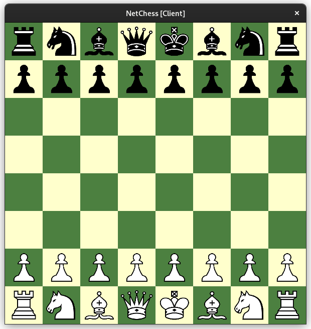

# A simple networked chess application
Written in C using OpenGL and Unix Sockets. Builds to a single portable executable.

## Building
```
sudo pacman -S freeglut soil
make
```

## Usage
Running the server
```
./chess -s -h 127.0.0.1 -p 8000
```
Running the client (server must already be running somewhere)
```
./chess -c -h 127.0.0.1 -p 8000
```

## Screenshots

